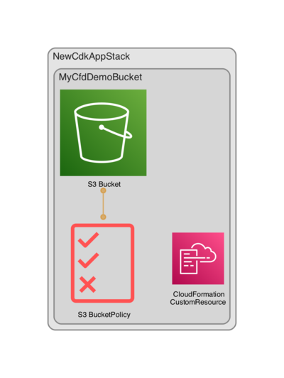

# Deploy an S3 Bucket with the AWS CDK

**If you run the script, it will install the latest AWS CDK version and set up a basic CDK project using Typescript.**   
**It needs all the files in the "demo" folder so leave them as is.**
**It contains just one resource, an AWS s3 Bucket**                 
**The purpose is to let you experience a basic IaC setup with the AWS CDK.**


> ### Prerequisites
>
> #### AWS profiles configured.
>
> #### AWS CLI installed:
> `curl "https://awscli.amazonaws.com/AWSCLIV2.pkg" -o "AWSCLIV2.pkg"`
> `sudo installer -pkg AWSCLIV2.pkg -target /`
> `aws --version`
>
> #### NODE installed:
> `curl -o- https://raw.githubusercontent.com/nvm-sh/nvm/v0.39.7/install.sh | bash`
> `nvm install --lts`
> `nvm use --lts`
> `node --version`
> `npm --version`

### Instructions

**First run this script and let it finish.**
```shell 
new-cdk-app.sh
```

**Then inside the "new-cdk-app" folder run these commands:**

* `npx cdk synth`   emits the synthesized CloudFormation template, check the `cdk.out` folder for a template.json file.
* `tsc`  compile typescript to js, check for errors.
* `tsc --build --clean` clean up .js files.
* `aws sso login`  use your terminal to log in to your AWS account.
* `npx cdk deploy NewCdkAppStack`  deploy this stack to your default AWS account.
* `aws s3 ls`  check for the 'my-cfd-demo-bucket' in your AWS account.
* `npx cdk destroy NewCdkAppStack`  destroy the resources, wait for the process to finish.


**If you want to remove the demo go to the directory where you installed it and run: `rm -rvf new-cdk-app`. If you re-run the demo it will first remove the old one.**                  
**This is a very simple stack, in a real world scenario you would use a pipeline to deploy your resources.**

**As you can see in the diagram, CDK generated a custom resource, that is because we used the auto delete objects option for the s3 Bucket.**                          

 

